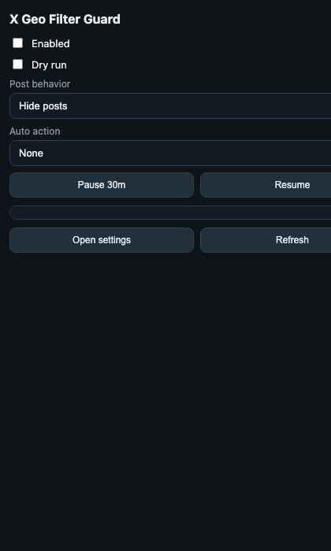
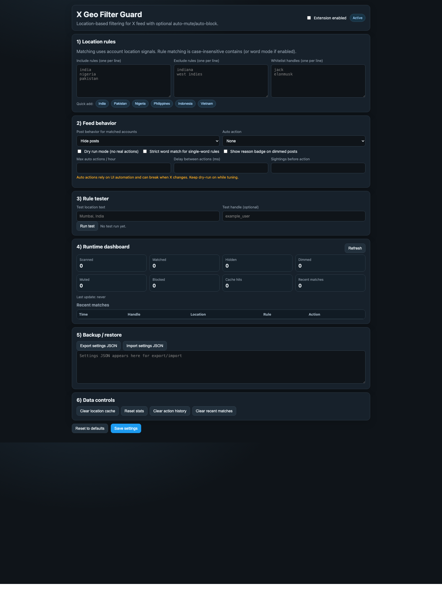

# Setup with Images

## 1) Open the popup

Use the extension icon in Chrome.

---

## 2) Open full settings

Click **Open settings** in the popup.

---

## 3) Configure rules and mode

In settings:
- Add countries/regions in **Include rules**
- Pick your mode:
  - Hide posts only
  - Auto mute
  - Auto block
- Click **Save settings**

---

## 4) Safety recommendation

Before real mute/block:
- Keep **Dry run** ON
- Set max actions/hour low
- Set delay between actions
- Increase sightings before action

Then test on feed, and only disable Dry run when satisfied.
